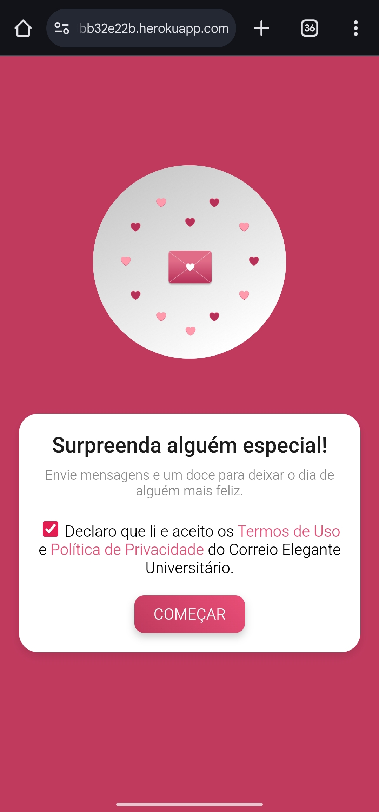
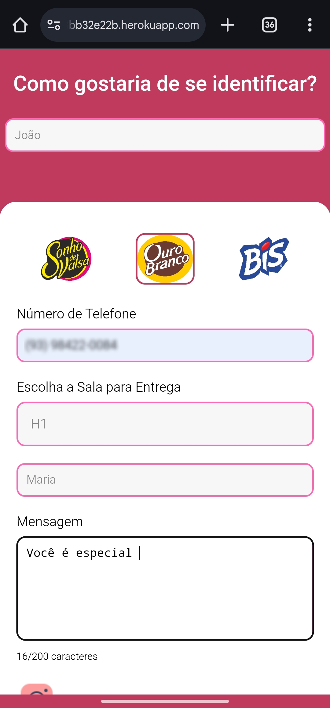
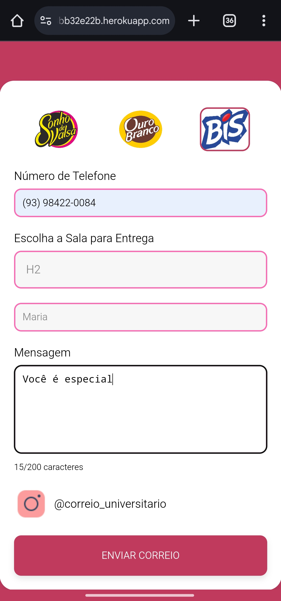

## 💌 Correio Elegante Universitário

**Correio Elegante Universitário Online** é um projeto desenvolvido para permitir que alunos enviem mensagens anônimas (ou identificadas) com a possibilidade de adicionar um doce.

## 📱 Telas do app
Aqui estão algumas capturas de tela do app **Correio Universitário**

#### Tela Inicial



#### Tela do App

 


#### Tela de Confirmação


#### Tela do WhatsApp


## 🎯 Funcionalidades
- **Página Inicial:** O usuário acessa a página principal e clica no botão "COMEÇAR".
- **Formulário de Pedido:** Na página do formulário, o usuário preenche os campos obrigatórios: nome, telefone, sala, destinatário e mensagem.
- **Seleção de Doce:** O usuário seleciona um doce entre Sonho de Valsa, Ouro Branco e Bis.
- **Envio de Mensagem:** Após a validação dos dados, a mensagem é enviada via WhatsApp com as informações do pedido e instruções de pagamento via PIX.
- **Confirmação:** Após a conclusão, o cliente é redirecionado para uma página de confirmação.

## 🚀 Tecnologias Utilizadas
- Backend: **Node.js** com Express
- Frontend: **HTML**, **CSS** e **JavaScript** puro
- Automação de mensagem : WhatsApp Web API
- Gerenciamento de Sessão: **LocalAuth**
- Hospedagem de Arquivos: Servidor estático via **Express**

## ⚙️ Instalação

### Pré-requisitos:
- Node.js instalado em sua máquina.
- Conta WhatsApp Business para automação.

### Passos para configurar o ambiente
1. Clonar este repositório para sua máquina local:
```bash
git clone https://github.com/AlexPablo-hub/Correio-Universitario.git
```
2. Navegue até o diretório do projeto:
```bash
cd Correio-Universitario
```
3. Instale as dependências do projeto.
```bash
npm install express whatsapp-web.js qrcode-terminal
```
4. Para facilitar o desenvolvimento, instale o nodemon (opcional):
```bash
npm install nodemon
```
5. Inicialize o servidor.
```bash
npm run dev
```
Isso vai iniciar o servidor **Node.js** e gerar um QR code para conectar a conta do WhatsApp, escaneie o QR code no terminal com o WhatsApp Business para automatizar o envio de mensagens.

## 📝 Como Usar
Acesse a página principal do projeto <http://localhost:3000.>
Preencha o formulário com seu nome, telefone, sala de entrega, nome do destinatário e mensagem.
Escolha um doce (Sonho de Valsa, Ouro Branco ou Bis).
Envie a mensagem e acompanhe a confirmação.
O valor total será calculado com base na escolha do doce e será mostrado na mensagem enviada via **WhatsApp** pelo telefone fornecido no formulário.

## 📂 Estrutura de Pastas
```perl
Correio-Universitario/
│
├── node_modules/             # Arquivos do servidor Node.js.
│
├── public/                   # Arquivos estáticos acessíveis pelo frontend.
│   ├── css/                  # Estilos para a páginas
│   │   ├── app.css
│   │   ├── confirmation.css
│   │   └── home.css
│   ├── img/                  # Imagens usadas nas páginas
│   │   ├── home.png
│   │   ├── bis-seeklogo.png
│   │   ├── logo2.png
│   │   ├── ouro-branco-seeklogo.png
│   │   └── sonho-de-valsa-seeklogo.png
│   ├── js/                  # Scrips Utilizados nos arquivos html
│   │   ├── app.js
│   │   └── home.js
│   ├── home.html
│   ├── app.html
│   ├── termosdeuso.html
│   └── confirmation.html
│
├── src/
│   ├── index.js             # Arquivo principal do servidor Node.js
|
├── package.json             # Configurações do projeto e dependências
├── package-lock.json        # Arquivo gerado com as dependências instaladas
├── README.md                # Arquivo de documentação do projeto
└── LICENSE                  # Arquivo de licença do projeto
```
## 📝 Licença
Este projeto está licenciado sob a licença MIT. Veja o arquivo [Licença MIT](./LICENSE). para mais detalhes.

## 👨‍💻 Desenvolvedor

Este projeto foi desenvolvido por **Alex Pablo de Oliveira Moraes**. 

Sou estudante de **Sistemas de Informação** na **UNEMAT**, apaixonado por tecnologia, programação e segurança de redes e tecnologias relacionadas ao desenvolvimento backend e segurança da informação.

Você pode me encontrar nas redes sociais ou conferir meus outros projetos no meu perfil [GitHub](https://github.com/AlexPablo-hub).

Se tiver alguma dúvida ou sugestão sobre o projeto, fique à vontade para entrar em contato!

**Correio Elegante Universitário** é um projeto feito com dedicação e carinho para proporcionar uma experiência divertida e única entre os estudantes. Espero que você aproveite! 💌
